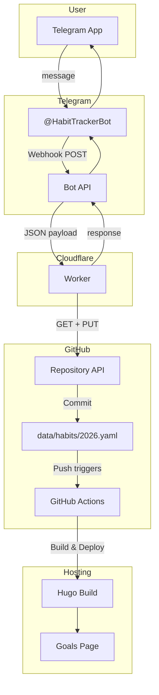

# Moony Blogs

> Musings from someone that is trying to get incrementally better every day.

## Telegram Habit Tracker

Overengineered habit tracking. Message a Telegram bot → updates YAML in GitHub → site rebuilds with updated chart.

### Architecture

### Data Flow

### Commands

| Command | Action |
|---------|--------|
| `<habit>` | Track habit (e.g., `meditation`, `reading`) |
| `<shortcut>` | Single letter shortcut (e.g., `m`, `r`) |
| `list` / `l` | Show today's progress |
| `help` / `h` | Show commands |
| `/add <name>` | Add new habit |
| `/delete <name>` | Hide habit |
| `/restore <name>` | Restore hidden habit |

Shortcuts are generated dynamically based on habit names (first available letter).

---

TODO:
- Use [commento++](https://github.com/souramoo/commentoplusplus?tab=readme-ov-file) for comments?
