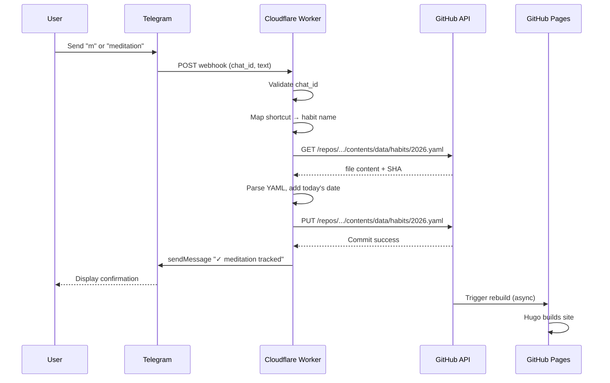

# Telegram Bot → GitHub Habit Tracking Integration

Overengineered habit tracking. Message a Telegram bot → updates YAML in GitHub → site rebuilds with updated chart.

## Architecture

```mermaid
flowchart TB
    subgraph User["User"]
        A[Telegram App]
    end

    subgraph Telegram["Telegram"]
        B[Bot API]
        C[@HabitTrackerBot]
    end

    subgraph Cloudflare["Cloudflare Worker"]
        D[Worker]
    end

    subgraph GitHub["GitHub"]
        E[Repository API]
        F[data/habits/2026.yaml]
        G[GitHub Actions]
    end

    subgraph Hosting["GitHub Pages"]
        H[Hugo Build]
        I[Goals Page]
    end

    A -->|"'meditation'"| C
    C -->|Webhook POST| B
    B -->|JSON payload| D
    D -->|"GET + PUT /contents/"| E
    E -->|Commit| F
    F -->|Push triggers| G
    G -->|Build & Deploy| H
    H --> I
    D -->|"✓ tracked"| B
    B --> C --> A
```

## Data Flow



## Commands

| Command | Shortcut | Action |
|---------|----------|--------|
| meditation | m | Track meditation |
| journaling | j | Track journaling |
| writing | w | Track writing |
| exercise | e | Track exercise |
| reading | r | Track reading |
| list | l | Show today's progress |
| help | - | Show commands |

## Security

1. **Webhook verification** - Telegram secret token header validation
2. **Chat ID filtering** - Only process messages from allowed user
3. **Input whitelist** - Only accept known habit names
4. **Fine-grained GitHub token** - Scoped to single repository, contents only
5. **Private repository** - Habit data not publicly accessible

## Environment Variables

| Variable | Description |
|----------|-------------|
| `TELEGRAM_BOT_TOKEN` | From @BotFather |
| `TELEGRAM_WEBHOOK_SECRET` | Random string for webhook verification |
| `GITHUB_TOKEN` | Fine-grained PAT (contents:write, single repo) |
| `GITHUB_REPO` | `username/moonblogs` |
| `GITHUB_BRANCH` | `main` |
| `ALLOWED_CHAT_ID` | Your Telegram user ID |

## Files

- `telegram-bot/worker.js` - Cloudflare Worker code
- `telegram-bot/setup.md` - Setup instructions
